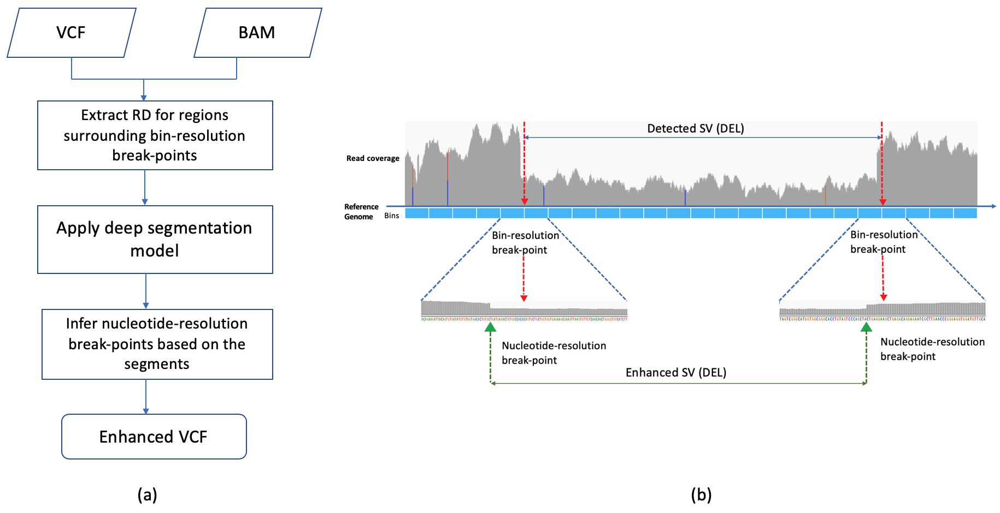
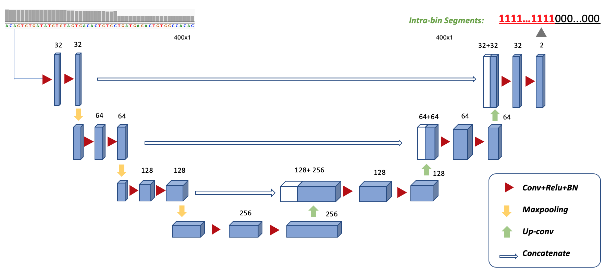

# Breakpoint enhancement for read-depth based SV callers

RDBKE is a breakpoint enhancment pipeline for read-depth (RD) based SV callers using deep segmenation model UNet.
UNet is used to learn specific patterns of base-wise RDs surrounding known breaking points.
It is designed for in-sample and cross-sample applications.
More details can be found in the manuscript https://doi.org/10.1101/503649

Old branch DeepIntraSV only contains model-level training and testing.
RDBKE branch added the enhancement module for RD-based SV callers (e.g., CNVnator).

* RDBKE overall pipeline


* Model structure of UNet used for RDBKE:


## Docker enviroment
We provide a docker image for running this code
```
docker pull yaozhong/deep_intra_sv:0.9
```
* ubuntu 16.04.4
* Tensorflow 1.8.0
* Keras 2.2.4

```
CODE_FOLD=<Absolute-PATH-to-CODE>
DATA_FOLD=<Absolute-PATH-to-DATA>
RESTULT_FOLD=<Absolute-PATH-to-RESULT>

CODE_FOLD=/data/working/1_Unet_IntraSV/deepIntraSV/code
DATA_FOLD=/data/working/1_Unet_IntraSV/data
RESTULT_FOLD=/data/working/1_Unet_IntraSV/deepIntraSV/result

nvidia-docker run -it --rm -v $CODE_FOLD:/code -v $DATA_FOLD:/data -v $RESTULT_FOLD:/result \
yaozhong/deep_intra_sv:0.9 bash


```

## Configuration file
The parameters can be changed in `code/config.py` file.
The following two parameters of file path are required to be pre-determined, and the format is:
```
bamFileID:bamFilePath
bamFileID:SV_annotation_path
```
Frequent parameters can be also changed through command line option.

### Required files
1. reference files are located in ./data/reference/, which includes required reference files: 
* reference genome fa file ``hs37d5.fa`` and index ``	hs37d5.fa.fai``(Please download from [1000genomes](http://ftp.1000genomes.ebi.ac.uk/vol1/ftp/technical/reference/phase2_reference_assembly_sequence/),
and put it in ``./data/reference``)
* mappability of 100-mer
* Encode hg19 blacklist regions
* hg19 Chromesome length 

2. SV annotation files./data/SV_annotation/
  (a python script is provided to parse VCF for SV regions)

## Data pre-processing and split
A multi-core version of pysam is used. 
By default, all cores will be used to generate RD bins from bam file. For each training data, 
background statistics of RDs are first calcuated through sampling WGS data.
Background statistics of each WGS data will be cached in `./data/data_cache/`.

There are two evluation metrics, which are determined through CMD parameter -em (evluation mode)
* in-sample: ``-em single``
* cross-sample: ``-em cross``

For the in-sample case, only one bam file is required and the data is split into train-test with the following data split -ds option:

* Stratify: Stratified Random split
* RandRgs: Random split
* CV: cross valdiation

The test-split-proportion can be specified with option ``-tsp``
For the cross-sample case, the second bam file used as the test set is assigned through ``-d2`` option.


## Breakpoint enhancement for CNVnator

```
sample_name="simA"
binSize=400
bam_file=""

genomeStat="hg19-INPUT_simA_RD_bin${binSize}_GENOMESTAT_SampleRate-0.01_Filter-Mappability-0.9"
model="../experiment/trained_models/sim/simA_RD_bin400_TRAIN_extendContext-0_dataAug-0_filter-BQ30-MAPQ-30_AnnoFile-simData:Sim-A.SV.vcf_UNet_networkstructure_basic_simA_b400_tsp0.8.h5"

# exclude regions
trainRgs="train_rgs/UNet_networkstructure_basic_simA_b${binSize}_tsp0.8-train_rgs.txt"

gVCF="Sim-A.SV.vcf"

# CNVnator predictions
pVCF="cnvnator.vcf"

python eval/enhance_bk.py -d $data -bam $bam_file -b $binSize -gs $genomeStat \
-mp $model -er $trainRgs -v $pVCF -vg $gVCF
```


## Training
Input are WGS bam file(s) and VCF file(s). 
Cached train-test data will be first searched according to current parameters,
If cache files are not found, the code will process the bam file and cache the data.

We provided a default hyperparameters of UNet and CNN in ``./experiment/model_param/``
Users can make changes of the parameter file or specifiy through command line option.
If no model parameter file is provided, the code will use hyperOpt to search preDefined hyper-parameter spaces based on the train set.

```
# Example
python train.py -b 1000 -em single -ds Stratify -d na12878_60x -da 0 -m UNet -g 0 -mp ../experiment/model_param/unet_default
```

## Testing model-level performance
```
# Example
python test.py -b 1000  -em single -ds Stratify -d na12878_60x -m UNet -mw ../experiment/trained_models/sim/simA_RD_bin400_TRAIN_extendContext-0_dataAug-0_filter-BQ30-MAPQ-30_AnnoFile-simData:Sim-A.SV.vcf_UNet_networkstructure_basic_simA_b400_tsp0.8.h5 -mp ../experiment/model_param/unet_default
```


